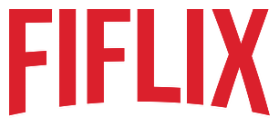
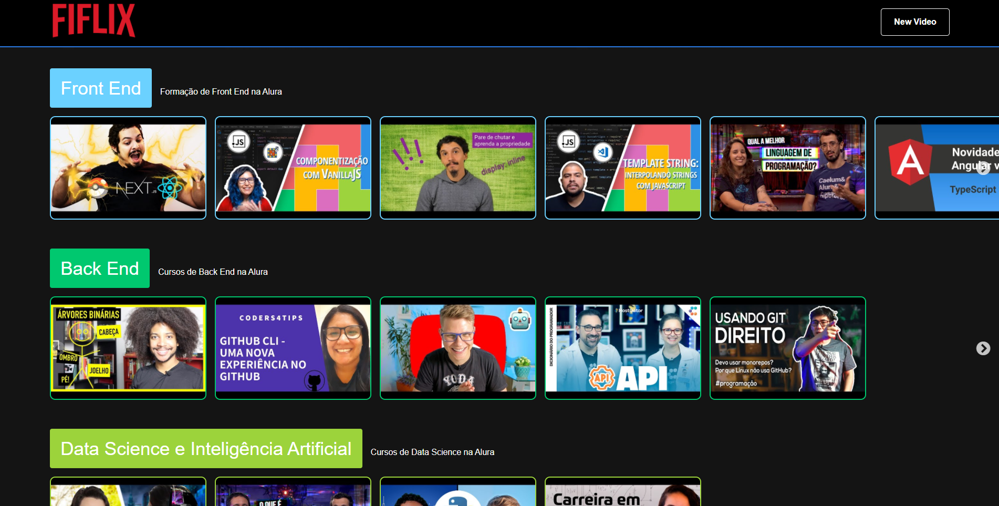

<h3 align="center">
    
    <br><br>
    <b>Something that really remember Netflix</b> 
</h3>

<p align="center">
  <a href="https://www.linkedin.com/in/filipe-cancellier-da-costa-8459ab160/">
    
  </a>

  

  

</p>

## :computer: Web

<h1 align="center">
    
</h1>

<!-- ## :iphone: Mobile

<h1 align="center">
    
    
</h1> -->

## :bookmark: About

The <strong>FIFLIX</strong> is a web app made having as inspiration the website Netflix, but using videos that are my favorites taken from the web.

## :rocket: Tech Used

This project was made with the following technologies:

<!-- - [TypeScript](https://www.typescriptlang.org/) -->
- [Node.js](https://nodejs.org/en/)
- [ReactJS](https://reactjs.org/)
<!-- - [React Native](https://reactnative.dev/) -->

## :fire: How to

- ### **Requirements**

  - It's **necessary** **[Node.js](https://nodejs.org/en/)**
  - You, **need** a package manager like **[NPM](https://www.npmjs.com/)** or **[Yarn](https://yarnpkg.com/)**.
  <!-- - Then, it's **essencial** install **[Expo](https://expo.io/)** -->

1. Clone the repo :

```sh
  $ git clone https://github.com/Cancellier27/React-Immersion
```

2. Execute the app:

```sh
  # Install all dependencies
  $ npm install 

  # Start the server API
  $ cd /React-Immersion
  $ npm run dev

```

## :memo: License

This project is under MIT license. [LICENSE](LICENSE.md)

## :mailbox_with_mail: Get in touch!

<a href="https://filipe-site.now.sh/" target="_blank" >
  
</a>&nbsp;&nbsp;&nbsp;
<a href="https://www.linkedin.com/in/filipe-cancellier-da-costa-8459ab160/" target="_blank" >
  
</a>&nbsp;&nbsp;&nbsp;
<a href="mailto:filipecancelliercosta@gmail.com" target="_blank" >
  
</a>